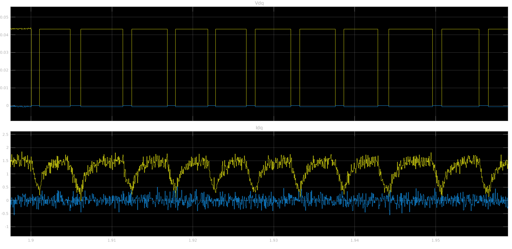
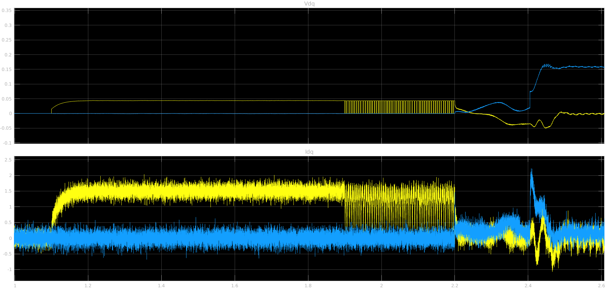
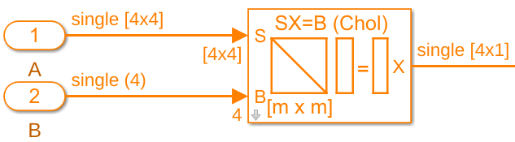

## Parameters Identification

### for motor PMSM
#### dsPIC embedded

parts comes from joint work with Dr. R.Delpoux from INSA Lyon (Fr)

---

## 2 steps

- Stand-still Identification (coarse)
  - {R, L}
  - Starts  Sliding Mode Observer with current control loop
- Runtime Identification (refined in situe)
  - {R, L and Ke}

---
## Stand-still Identification

- R during rotor "alignement" (800ms)
- L during current relaxation phase (300ms)

- Assuming: $Ts \<\< \tau$

with $Ts$ Sample time and $\tau = \frac{L}{R}$

---

## relaxation phase

$A \exp(-\frac{nT_s}{\tau})$ 

with

$ \exp(-\frac{nT_s}{\tau}) = 1 -\frac{nT_s}{\tau} + \frac{(\frac{nT_s}{\tau})^2}{2!} + \ldots$

---
## initialisation sequence

up: $V_{dq}$ down: $I_{dq}$

---

## relaxation phase

$ \frac{x_{n+1} - x_n}{x_n} = \exp(-\frac{Ts}{\tau})- 1$

$ \frac{x_{n+1} - x_n}{x_n} \approx -\frac{Ts}{\tau} + \frac{(\frac{Ts}{\tau})^2}{2!} - \frac{(\frac{Ts}{\tau})^3}{3!} + \ldots$

$ \frac{x_{n+1} - x_n}{x_n} \approx -\frac{Ts}{\tau} + O(\frac{Ts}{\tau}^2)$

---

## relaxation phase

$ \frac{x_{n+1} - x_n}{x_{n+1} + x_n} = -\tanh(\frac{Ts}{2\tau}) $

$ \frac{x_{n+1} - x_n}{x_{n+1} + x_n} \approx -\frac{Ts}{2\tau} + \frac{Ts^3}{24\tau^3} + \ldots$

- Increased precision (Mitigate denominator noise)
- Increased accuracy ($O(\frac{Ts}{\tau}^3$)

---

## relaxation phase

Averaging on one or more relaxation phase (for 300ms)

$ \frac{1}{N}\sum_n \frac{x_{n+1} - x_n}{x_{n+1} + x_n} \approx -\frac{Ts}{2\tau} + O(\frac{Ts}{\tau}^3)$)

---

## initialisation sequence

up: $V_{dq}$ down: $I_{dq}$

---

## Static ident results
### Long Hurst motor
  - R = 0.671 Ohm	L = 0.229 mH
  - R = 0.678 Ohm	L = 0.271 mH
  - R = 0.663 Ohm	L = 0.198 mH
  - R = 0.678 Ohm	L = 0.271 mH
  - R = 0.670 Ohm	L = 0.227 mH
  - R = 0.671 Ohm	L = 0.237 mH
  - R = 0.647 Ohm	L = 0.185 mH

---

## Static ident results
### Short Hurst motor
  - R = 2.561 Ohm	L = 1.741 mH
  - R = 2.582 Ohm	L = 1.610 mH
  - R = 2.699 Ohm	L = 1.871 mH
  - R = 2.588 Ohm	L = 2.022 mH
  - R = 2.776 Ohm	L = 2.180 mH
  - R = 2.672 Ohm	L = 1.606 mH
  - R = 2.709 Ohm	L = 1.629 mH

---

## Next Step  

Parameters {R,L} are good enough to start:

- current control loop
- Sliding Mode Observer

-> refine parameteres during runtime

---

## running identification

Motor electric equations when set

$\begin{bmatrix} v_d\\\\ v_q \end{bmatrix}  = 
\begin{bmatrix} i_d & -\omega i_q & 0 \\\\ i_q & \omega i_d & \omega \end{bmatrix} 
\begin{bmatrix} R \\\\ L \\\\ Ke \end{bmatrix} $

following part from joint work with Dr. R.Delpoux from INSA Lyon (Fr, [Lab ampere](https://rtdc.ctrl-elec.fr/))

---

## running identification

$\underbrace{\begin{bmatrix} v_d\\\\ v_q \end{bmatrix}}_y = 
\underbrace{\begin{bmatrix} i_d & -\omega i_q & 0 \\\\ i_q & \omega i_d & \omega \end{bmatrix}}_A 
\underbrace{\begin{bmatrix} R \\\\ L \\\\ Ke \end{bmatrix}}_x $

Minimum Mean Square Error (MMSE): $\min_x\left(y-Ax\right)^2$

best fit for the model might not be the best real parameters values

---

## running identification

$\underbrace{\begin{bmatrix} v_d\\\\ v_q \end{bmatrix}}_y = 
\underbrace{\begin{bmatrix} i_d & -\omega i_q & 0 \\\\ i_q & \omega i_d & \omega \end{bmatrix}}_A 
\underbrace{\begin{bmatrix} R \\\\ L \\\\ Ke \end{bmatrix}}_x $

$\min_x\left(y-Ax\right)^2$

$\frac{d}{dx}\left( y^ty - 2y^tAx + x^tA^tAx \right) = 0$

$ (A^tA)x_{best} = y^tA$

$x_{best} = -(A^tA)^{-1}*y^tA$

---

## implementation

$\underbrace{A^tA}_{\text{3x3 matrix}} = \sum_n \begin{bmatrix} i_d^n & i_q^n \\\\ -\omega^n i_q^n  & \omega i_d^n \\\\ 0 & \omega^n \end{bmatrix} 
\begin{bmatrix} i_d^n & -\omega^n i_q^n & 0 \\\\ i_q^n & \omega i_d^n & \omega^n \end{bmatrix} 
$

$\underbrace{y^tA}_{\text{3x1 vector}} = \sum_n \begin{bmatrix} v_d^n & v_q^n \end{bmatrix} 
\begin{bmatrix} i_d^n & -\omega^n i_q^n & 0 \\\\ i_q^n & \omega i_d^n & \omega^n \end{bmatrix} $

Solve $Ax=b$ linear system with Cholesky factorization 

---

## Simulink block Cholesky

Solve $Ax=b$ linear system with Cholesky factorization 

---

## remarks

- requires > 3 states (speed, load, $I_d injection$...)
- use data history from the beginning
- better results with higher current (i.e. load)

$(y-Ax)$ error indicate parameters mismatch/changes

---

## runtime ident results

### short hurst

- R = 2.655 Ohm	L = 2.554 mH	Phif = 4.320 V/Krpm
- R = 2.699 Ohm	L = 2.604 mH	Phif = 4.290 V/Krpm
- R = 2.696 Ohm	L = 2.630 mH	Phif = 4.293 V/Krpm
- R = 2.772 Ohm	L = 2.592 mH	Phif = 4.277 V/Krpm
- R = 2.750 Ohm	L = 2.609 mH	Phif = 4.281 V/Krpm
- R = 2.666 Ohm	L = 3.885 mH	Phif = 4.278 V/Krpm
- R = 2.789 Ohm	L = 2.583 mH	Phif = 4.252 V/Krpm

---

## runtime ident results

### long hurst

- R = 0.571 Ohm	L = 0.305 mH	Phif = 4.199 V/Krpm
- R = 0.648 Ohm	L = 0.338 mH	Phif = 4.192 V/Krpm
- R = 0.604 Ohm	L = 0.248 mH	Phif = 4.199 V/Krpm
- R = 0.640 Ohm	L = 0.271 mH	Phif = 4.197 V/Krpm
after reset (remove standstill data history)
- R = 0.487 Ohm	L = 0.242 mH	Phif = 4.245 V/Krpm
- R = 0.472 Ohm	L = 0.257 mH	Phif = 4.250 V/Krpm
- R = 0.480 Ohm	L = 0.280 mH	Phif = 4.246 V/Krpm
- R = 0.481 Ohm	L = 0.280 mH	Phif = 4.245 V/Krpm

---

## go further

Other method tested without angle requirement 

requires ${v_\alpha, v_\beta, i_\alpha, i_\beta}$

Works in open-loop during startup. 

Require solving system with constraints. 

---

et voilà !

---

## Appendix

---

## Tasking

<section data-background-image="./Scope_MultiTasking_SchedulerIllustration.png" data-background-opacity=1 data-background-position="center" data-background-size="contain">>
</section>