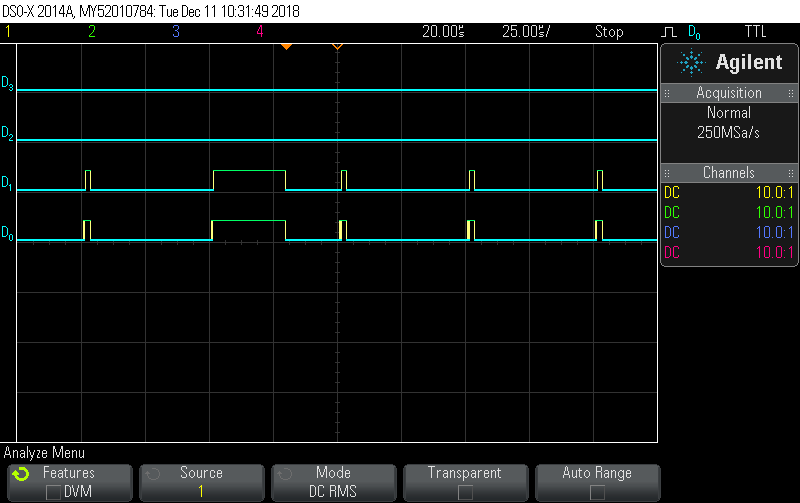
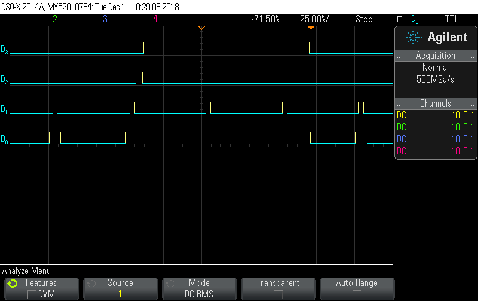
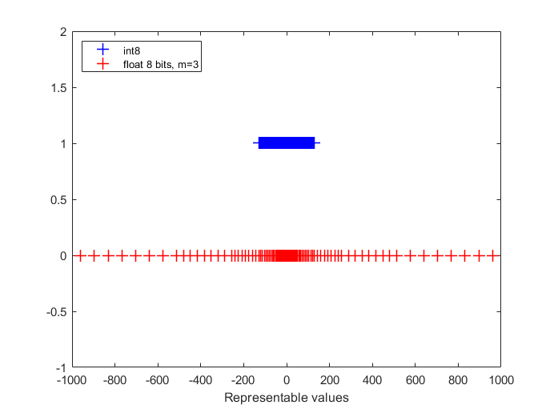
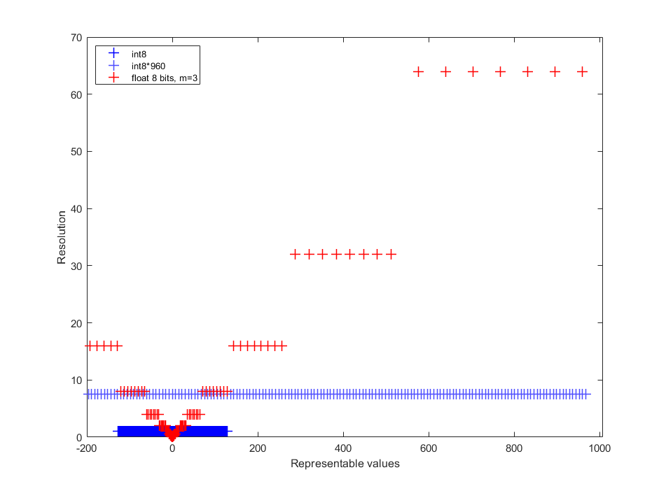
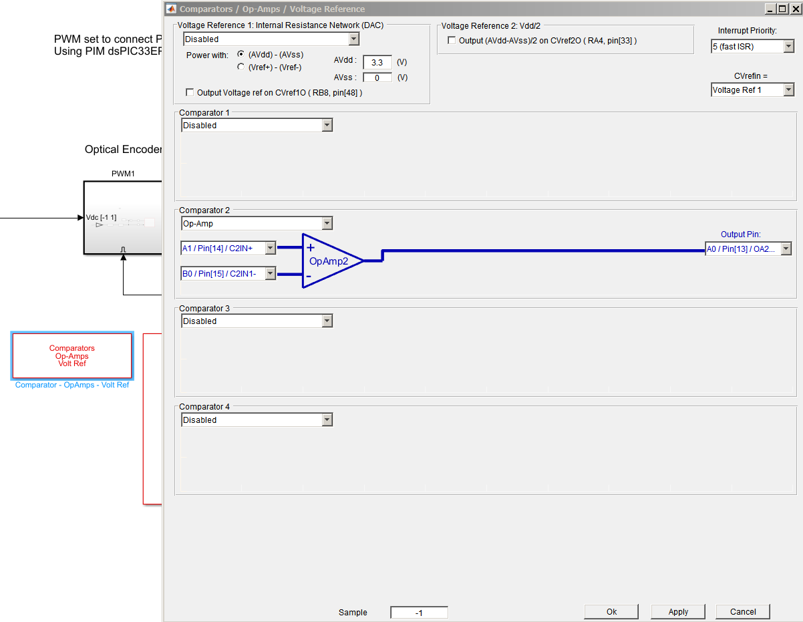
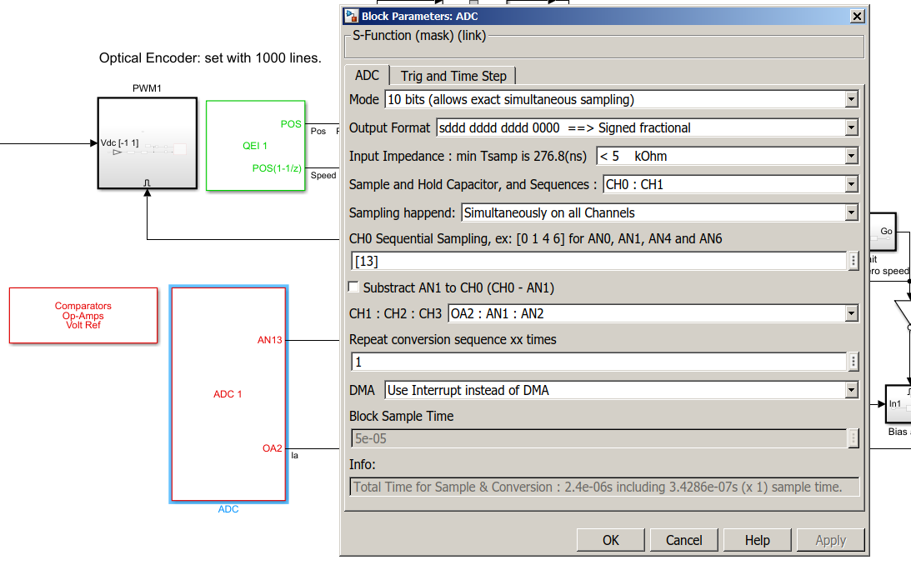
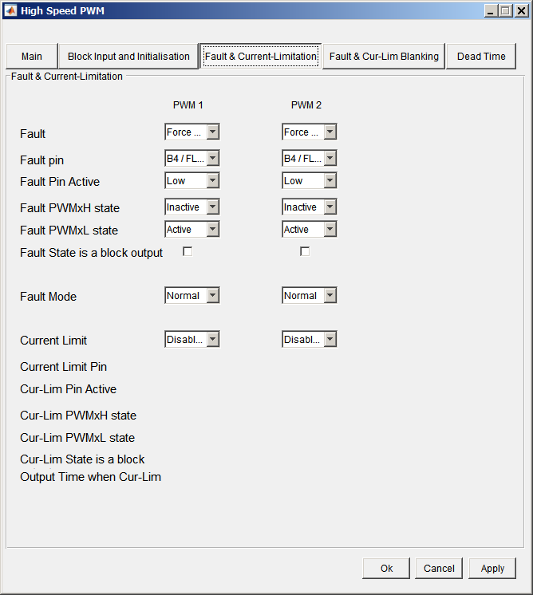
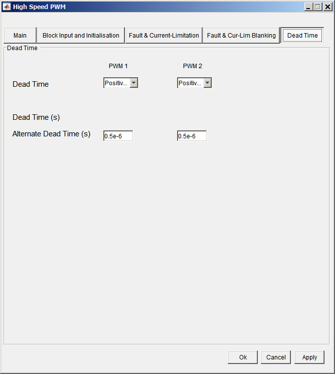

+++
title = "Prototypage Rapide avec Simulink sur dsPIC"


[reveal_hugo]
# Choose a theme from https://github.com/hakimel/reveal.js#theming
theme = "black"

slide_number = true
progress = true 
transition = "zoom"


+++
 
# Prototypage rapide

## avec Simulink sur dsPIC

[MPLAB device blocks for Simulink][blockset]

L.Kerhuel & R.Delpoux

<section data-background-image="./Model_Hardware_Test_withSampleTime.png" data-background-opacity=0.06>
</section>

---

## Pendule inverse


<section data-background-image="./Model_Hardware_Test_withSampleTime.png" data-background-opacity=0.06>
</section>

---


---


[Video](C:/M91449/MCHP_Blockset/Developpements/2013_08_19_Masters2013/Fig/Video_Logs_Shirp.avi)

---


---


---


---




---

## Plan:
Modèle de simulation & génération de code

- Différences Temporel
- optimisation et type de données
- blocks et fonctionnalités Simulink


DSPACE 


---

## Aspect Temporel:
### Simulation

Modélisation en temps continue, transformé de Laplace dans le domaine p (ou s)

  - Solver résout les équations différentielles
  - Pas de contrainte temps réelle
  - Résultat dépend du solveur ; pas de calcul variable.
 
---

## Aspect Temporel:
### Implémentation

Implémentation en temps discret avec un pas de calcul fixe

  - pas de solveur 
  - Contrainte temps réel
  - Single-Rate & Multi-Rate
  - Single-Tasking & Multi-Tasking

<section data-background-image="./Scope_SingleTasking_70MIPS.png" data-background-opacity=0.06 data-background-position="center" >
</section>

---

## Discrete times

- **Single-rate**:
  - Les blocks ont tous la même période d'exécution
    (Même couleur)

- **Multi-Rate**
  - Les blocks peuvent avoir des périodes d'exécution différentes
    (Schéma multicolore)


<section data-background-image="./Scope_SingleTasking_70MIPS.png" data-background-opacity=0.06 data-background-position="center" >
</section>

---

#### Modèle multi-rate


---

#### Charge CPU d'un modèle multi-rate single-tasking (@70 mips)



<section data-background-image="./Scope_SingleTasking_70MIPS.png" data-background-opacity=0.06 data-background-position="center" >
</section>


---

#### Charge CPU d'un modèle multi-rate single-tasking (@20 mips) 


<section data-background-image="./Scope_SingleTasking_20MIPS.png" data-background-opacity=0.06 data-background-position="center" >
</section>

---

## Single-Tasking

Single-Tasking: Dans le slot de temps, l'exécution de tous les blocks doit se terminer avant la fin du slot. 

---

## Multi-Tasking

Multi-Tasking: Préemption possible -> **Monotonic Rate Scheduler**

- La tâche la plus fréquente à la priorité maximale
  - Préemptera une tache plus lente
  - Beaucoup plus flexible
  - Mode par défaut (voir options du solveur)

---

#### Charge CPU d'un modèle multi-rate single-tasking (@70 mips) 


<section data-background-image="./Scope_MultiTasking_70MIPS.png" data-background-opacity=0.06 data-background-position="center" >
</section>

---

#### Charge CPU d'un modèle multi-rate single-tasking (@20 mips) 



<section data-background-image="./Scope_MultiTasking_20MIPS.png" data-background-opacity=0.06 data-background-position="center" >
</section>

---

## Tasking Conclusion

- Single-Tasking @ 20  MIPS  -> **Overload**
  - dispatcher la tache la plus lente sur plusieurs slots
  - (option d'offset dans **Time Step** -> *[.001 .005])*
- Multi-Tasking @ 20  MIPS  -> **Ok**
  - Rate transfert block options
      - Data Integrity
      - Deterministic data transfert

---

# Optimisation 

## type de données

- Virgule Fixe
- Virgule Flottante


---


---

## Flotant

 IEEE 754| Single | Double |
|:---:|:---:|:---:|
 Format width | 32 | 64 |
 Sign bit |1 | 1 |
 exponent width | 8 | 11 |
 Precision width| 23+1 | 52+1 |

1st bit of the significand is always 1. Phantom bit

---

## Custom 8 bit Floating point

 Parameter | Single | Double | Custom 
|:---:|:---:|:---:|:---:|
 Format width | 32 | 64 | 8 |
 Sign bit |1 | 1 | 1 |
 exponent width | 8 | 11 | 4 |
 Precision width| 23+1 | 52+1 | 3+1 | 
 
---



---


---



---
## Script Matlab pour tester un flottant 8 bits

```MATLAB
% 4 bit exponent (signed)
emin = -7; emax = 6; 
% 3 bits significand
p = 3;

exps = 2.^[emin:emax]; 
vals = (2^p) + [0:(2^p-1)];  % significand with leading 1

TotalVal = vals'*exps;

% add denormalized values
8bitFloat = unique([TotalVal  ; 2^emin * [0:(2^m-1)]']);
8bitFloat = unique(flipud(-TotalVal) ;TotalVal]); % with neg vals
```

---

# Simulink 

---

## Data-type 


---

## Datatype 

- int8...uint23
- fixdt(1,16,15)
  - Scaling is En15 (Exp neg)
    -  $$\rightarrow 2^-15$$
- fixdt(1,16)
  - signed (1)
  - 16 bit width
  - Scaling is derived from min & max


---

## Datatype 


- fixdt(1,16,.01,0)
  - Scaling is sfix16**Sp**01 
    - Slope point 01    

---


---

# TP


## https://www.ctrl-elec.fr/

https://hugo.kerhuel.eu/slides/slides-dcmotor/

---

## Elements de correction

---




---



---

# PWM settings

---


---


---




---


---





---


# Test slides

---


<section data-background-iframe="https://www.youtube.com/embed/algBpBeQIOY?autoplay=1&controls=1&showinfo=0&autohide=1&rel=0&modestbranding=1&loop=&start=0" data-background-opacity=0.06 data-background-repeat="repeat">
</section>

# My Title !

---





---



mes notes


---


## Controls

- Next: `Right Arrow` or `Space`
- Previous: `Left Arrow`
- Start: `Home`
- Finish: `End`
- Overview: `Esc`
- Speaker notes: `S`
- Fullscreen: `F`
- Zoom: `Alt + Click`
- [PDF Export](https://github.com/hakimel/reveal.js#pdf-export): `E`

---

## Code Highlighting

Inline code: `variable`

Code block:
```python
porridge = "blueberry"
if porridge == "blueberry":
    print("Eating...")
```

---

## Math

In-line math: $x + y = z$

Block math:

$$
f\left( x \right) = \;\frac{{2\left( {x + 4} \right)\left( {x - 4} \right)}}{{\left( {x + 4} \right)\left( {x + 1} \right)}}
$$

---

## Fragments

Make content appear incrementally

```
{} One {}
{} **Two** {}
{} Three {}
```

Press `Space` to play!

{} One {}
{} **Two** {}
{} Three {}

---

A fragment can accept two optional parameters:

- `class`: use a custom style (requires definition in custom CSS)
- `weight`: sets the order in which a fragment appears

---

## Speaker Notes

Add speaker notes to your presentation

```markdown
{}
- Only the speaker can read these notes
- Press `S` key to view
{}
```

Press the `S` key to view the speaker notes!


- Only the speaker can read these notes
- Press `S` key to view


---

## Themes

- black: Black background, white text, blue links (default)
- white: White background, black text, blue links
- league: Gray background, white text, blue links
- beige: Beige background, dark text, brown links
- sky: Blue background, thin dark text, blue links

---

- night: Black background, thick white text, orange links
- serif: Cappuccino background, gray text, brown links
- simple: White background, black text, blue links
- solarized: Cream-colored background, dark green text, blue links

---



## Custom Slide

Customize the slide style and background

```markdown



```

---

## Custom CSS Example

Let's make headers navy colored.

Create `assets/css/reveal_custom.css` with:

```css
.reveal section h1,
.reveal section h2,
.reveal section h3 {
  color: navy;
}
```

---

# Questions?

[Ask](https://discourse.gohugo.io)

[Documentation](https://sourcethemes.com/academic/docs/)

---

[MPLABX]: https://www.microchip.com/MPLABX "Microchip development environment"
[blockset]: https://www.microchip.com/SimulinkBlocks "Blockset for dsPIC and PIC32"
