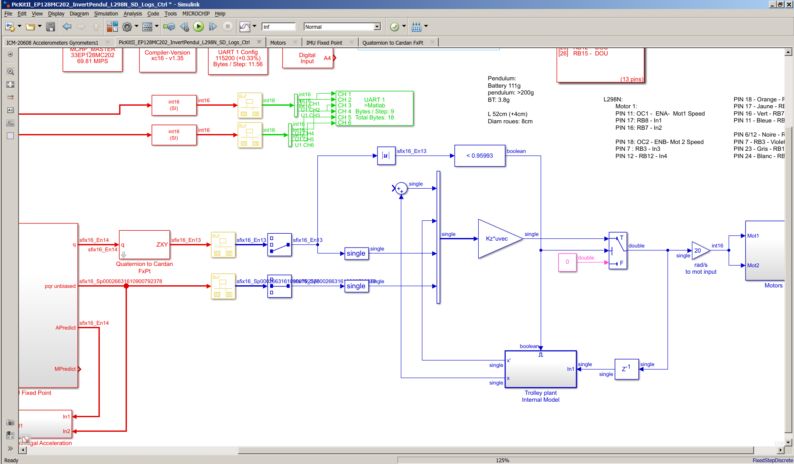
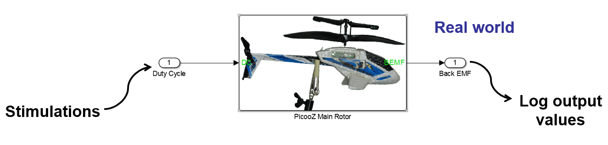
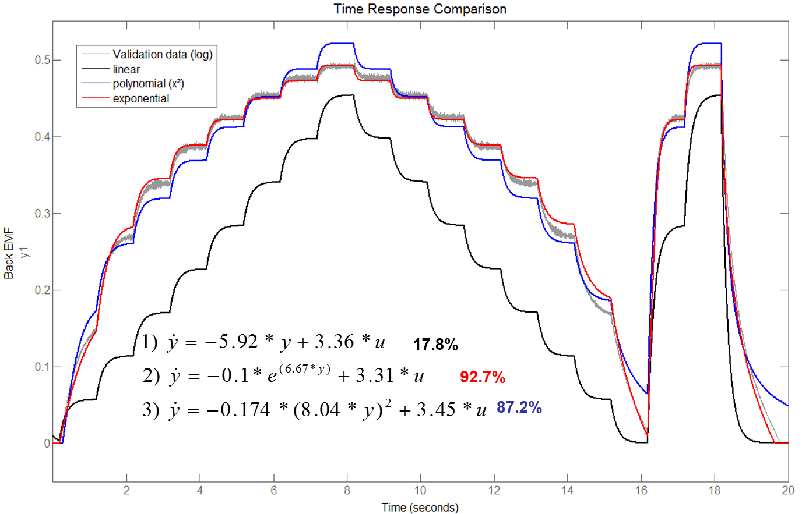
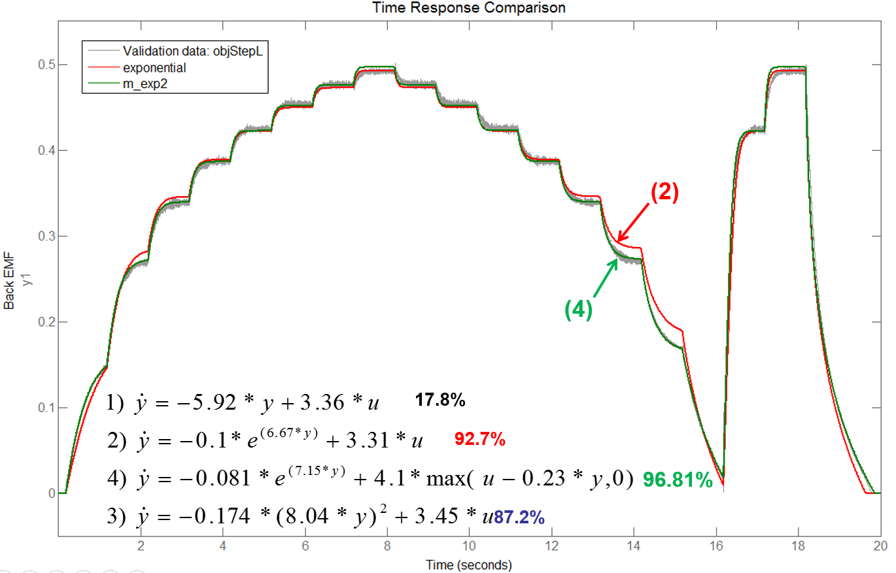
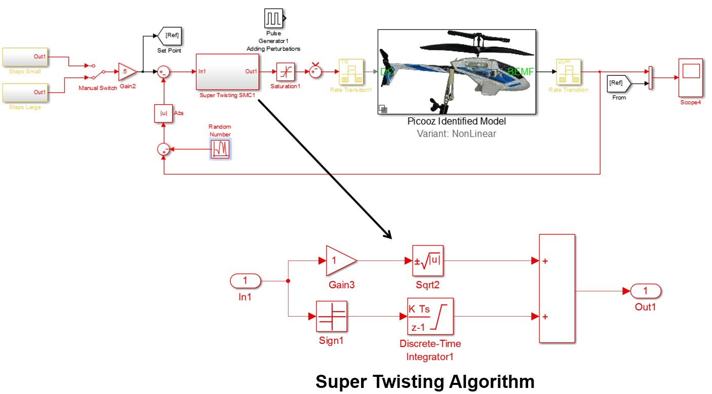
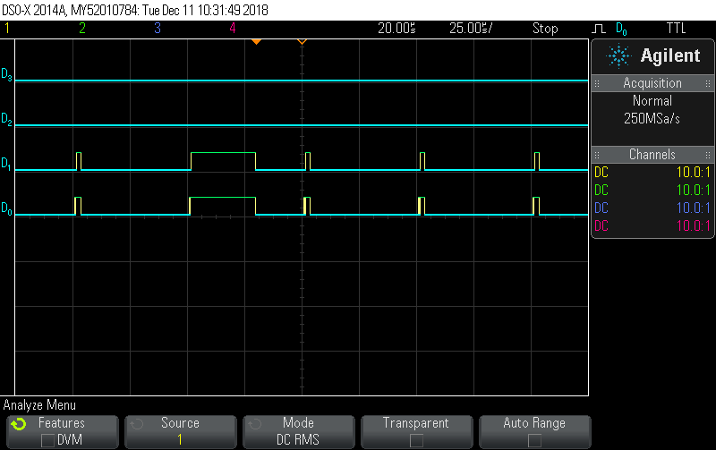
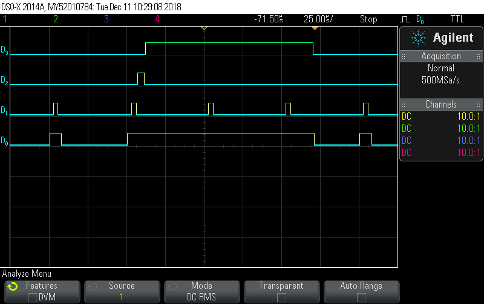
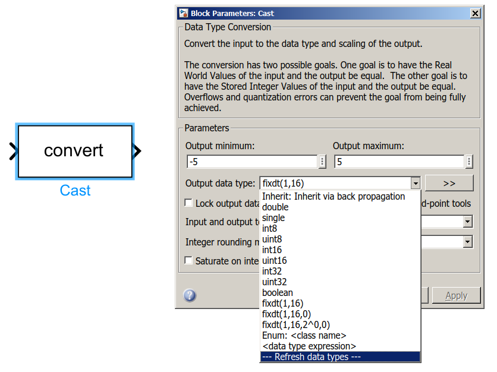
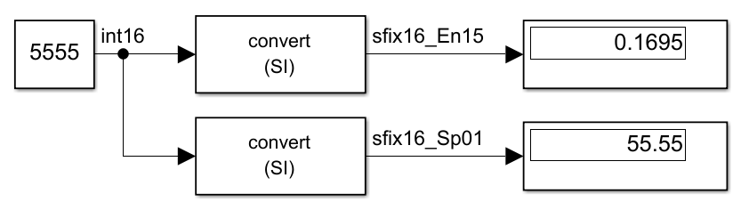
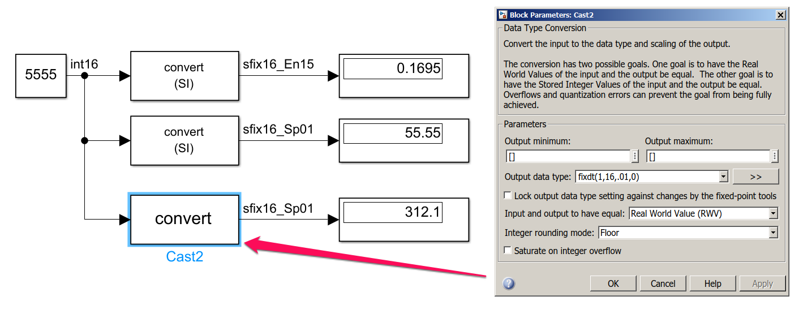

---
title: Prototypage Rapide avec Simulink sur dsPIC

sitemap:
  priority: 1

slides:
  # Choose a theme from https://github.com/hakimel/reveal.js#theming
  theme: black  # Reveal JS theme name
  highlight_style: dracula  # Highlight JS theme name
  
  #slide_number: true
  progress: true 
  transition: zoom
  transition_speed: fast
  history: false

  defaultTiming: 120
  mouseWheel: true

  previewLinks: true

  backgroundTransition: fade
  
---

# Prototypage rapide

## avec Simulink sur dsPIC

[MPLAB device blocks for Simulink](https://www.mathworks.com/matlabcentral/fileexchange/71892-mplab-device-blocks-for-simulink)

[L.Kerhuel](/) & [R.Delpoux](http://www.ctrl-elec.fr/)
 
---

## [Pendule inverse](/docs/inverted-pendulum/)



---

<p class="stretch">

</p>

---



<!-- [Video](C:/M91449/MCHP_Blockset/Developpements/2013_08_19_Masters2013/Fig/Video_Logs_Shirp.avi) -->

---



---



---



---



<section data-background-image="./Picooz_SetpLarge_ClosedLoop_SimuVsReal.png" data-background-opacity=1 data-background-position="center" data-background-size="contain" >
</section>

---

## Plan:
Modèle de simulation & génération de code

- Différences Temporel
- optimisation et type de données
- blocks et fonctionnalités Simulink


dSPACE 


---

## Aspect Temporel:
### Simulation

Modélisation en temps continue, transformé de Laplace dans le domaine p (ou s)

  - Solver résout les équations différentielles
  - Pas de contrainte temps réelle
  - Résultat dépend du solveur ; pas de calcul variable.
 
---

## Aspect Temporel:
### Implémentation

Implémentation en temps discret avec un pas de calcul fixe

  - pas de solveur 
  - Contrainte temps réel
  - Single-Rate & Multi-Rate
  - Single-Tasking & Multi-Tasking

<section data-background-image="./Scope_SingleTasking_70MIPS.png" data-background-opacity=0.06 data-background-position="center" >
</section>

---

## Discrete times

- **Single-rate**:
  - Les blocks ont tous la même période d'exécution
    (Même couleur)

- **Multi-Rate**
  - Les blocks peuvent avoir des périodes d'exécution différentes
    (Schéma multicolore)


<section data-background-image="./Scope_SingleTasking_70MIPS.png" data-background-opacity=0.06 data-background-position="center" >
</section>

---

#### Modèle multi-rate

<p class="stretch">

</p>

---

#### Charge CPU d'un modèle multi-rate single-tasking (@70 mips)



<section data-background-image="./Scope_SingleTasking_70MIPS.png" data-background-opacity=0.06 data-background-position="center" >
</section>


---

#### Charge CPU d'un modèle multi-rate single-tasking (@20 mips) 


<section data-background-image="./Scope_SingleTasking_20MIPS.png" data-background-opacity=0.06 data-background-position="center" >
</section>

---

## Single-Tasking

Single-Tasking: Dans le slot de temps, l'exécution de tous les blocks doit se terminer avant la fin du slot. 

---

## Multi-Tasking

Multi-Tasking: Préemption possible -> **Monotonic Rate Scheduler**

- La tâche la plus fréquente à la priorité maximale
  - Préemptera une tache plus lente
  - Beaucoup plus flexible
  - Mode par défaut (voir options du solveur)

---

#### Charge CPU d'un modèle multi-rate single-tasking (@70 mips) 


<section data-background-image="./Scope_MultiTasking_70MIPS.png" data-background-opacity=0.06 data-background-position="center" >
</section>

---

#### Charge CPU d'un modèle multi-rate single-tasking (@20 mips) 



<section data-background-image="./Scope_MultiTasking_20MIPS.png" data-background-opacity=0.06 data-background-position="center" >
</section>

---

## Tasking Conclusion

- Single-Tasking @ 20  MIPS  -> **Overload**
  - dispatcher la tache la plus lente sur plusieurs slots
  - (option d'offset dans **Time Step** -> *[.001 .005])*
- Multi-Tasking @ 20  MIPS  -> **Ok**
  - Rate transfert block options
      - Data Integrity
      - Deterministic data transfert

---

# Optimisation 

## type de données

- Virgule Fixe
- Virgule Flottante


---

<section data-background-image="./FloatFixed_1.png" data-background-opacity=1 data-background-position="center" data-background-size="contain" >
</section>

---

## Flotant

 IEEE 754| Single | Double |
|:---:|:---:|:---:|
 Format width | 32 | 64 |
 Sign bit |1 | 1 |
 exponent width | 8 | 11 |
 Precision width| 23+1 | 52+1 |

1st bit of the significand is always 1. Phantom bit

---

## Custom 8 bit Floating point

 Parameter | Single | Double | Custom 
|:---:|:---:|:---:|:---:|
 Format width | 32 | 64 | 8 |
 Sign bit |1 | 1 | 1 |
 exponent width | 8 | 11 | 4 |
 Precision width| 23+1 | 52+1 | 3+1 | 
 
---

<section data-background-image="./FloatFixed_2.png" data-background-opacity=1 data-background-position="center" data-background-size="contain" >
</section>

---

<section data-background-image="./FloatFixed_3.png" data-background-opacity=1 data-background-position="center" data-background-size="contain" >
</section>

---

<section data-background-image="./FloatFixed_4.png" data-background-opacity=1 data-background-position="center" data-background-size="contain" >
</section>

---
## Script Matlab pour tester un flottant 8 bits

```MATLAB
% 4 bit exponent (signed)
emin = -7; emax = 6; 
% 3 bits significand
p = 3;

exps = 2.^[emin:emax]; 
vals = (2^p) + [0:(2^p-1)];  % significand with leading 1

TotalVal = vals'*exps;

% add denormalized values
8bitFloat = unique([TotalVal  ; 2^emin * [0:(2^m-1)]']);
8bitFloat = unique(flipud(-TotalVal) ;TotalVal]); % with neg vals
```

---

# Simulink 

---

## Data-type 

<p class="stretch">

</p>

---

## Datatype 

- int8...uint23
- fixdt(1,16,15)
  - Scaling is En15 (Exp neg)
    -  $$\rightarrow 2^-15$$
- fixdt(1,16)
  - signed (1)
  - 16 bit width
  - Scaling is derived from min & max

---

## Datatype 



- fixdt(1,16,.01,0)
  - Scaling is sfix16**Sp**01 
    - Slope point 01    

---



---

# TP


## https://www.ctrl-elec.fr

https://lubin.kerhuel.eu/slides/slides_dcmotor_insa

---

## Elements de correction

---

<section data-background-image="./TP_Correction_OpAmp.png" data-background-opacity=1 data-background-position="center" data-background-size="contain" >
</section>

---

<section data-background-image="./TP_Correction_ADC.png" data-background-opacity=1 data-background-position="center" data-background-size="contain" >
</section>

---

## PWM settings

---

<section data-background-image="./TP_Correction_PWM_Main.png" data-background-opacity=1 data-background-position="center" data-background-size="contain" >
</section>

---

<section data-background-image="./TP_Correction_PWM_02.png" data-background-opacity=1 data-background-position="center" data-background-size="contain" >
</section>

---

<section data-background-image="./TP_Correction_PWM_03.png" data-background-opacity=1 data-background-position="center" data-background-size="contain" >
</section>

---

<section data-background-image="./TP_Correction_PWM_04.png" data-background-opacity=1 data-background-position="center" data-background-size="contain" >
</section>


---

<section data-background-image="./TP_Correction_PWM_05.png" data-background-opacity=1 data-background-position="center" data-background-size="contain" >
</section>

---

## Liens:

- MPLAB device blocks for Simulink:
	https://www.mathworks.com/matlabcentral/fileexchange/71892-mplab-device-blocks-for-simulink
- MPLAB X:
	https://www.microchip.com/MPLABX
- XC16:
	https://www.microchip.com/XC16

- https://lubin.kerhuel.eu
- http://www.ctrl-elec.fr
