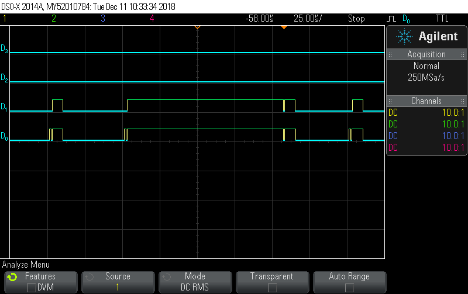
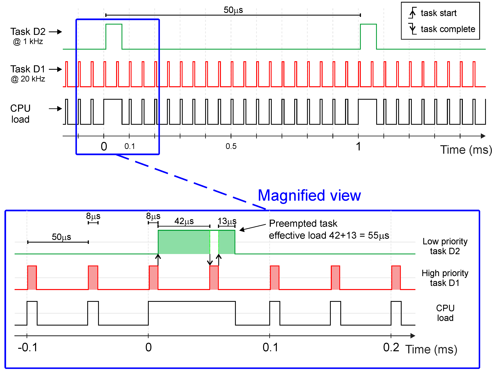

## Prototypage Rapide 
### Model Based Design

<p class="stretch">
<a href="https://fr.mathworks.com/matlabcentral/fileexchange/71892-mplab-device-blocks-for-simulink-dspic-pic32-and-sam-mcu/">

</a>
</p>

\[[Lab](https://rtdc.ctrl-elec.fr/)\] - [L.Kerhuel](/authors/lubin) - [R.Delpoux](/authors/romain-delpoux)

---
## Plan:
- Model Based Design
  - Model

- De la simulation au programme embarqué
  - Différences temporelles
  - type de données et optimisation

---

## Model Based Design (MDB)


---

## Model Based Design (MDB)


---

## Model Based Design (MDB)


---


<p class="stretch">

</p>


Commande en Vitesse
   

---

## Model Based Design (MDB)



Identification
   


---
## Model Based Design (MDB)


<!--  -->
<!-- [Video](C:/M91449/MCHP_Blockset/Developpements/2013_08_19_Masters2013/Fig/Video_Logs_Shirp.avi) -->

---


---



rasoir d'Ockham
   


---


---


<section data-background-image="./Picooz_SetpLarge_ClosedLoop_SimuVsReal.png" data-background-opacity=1 data-background-position="center" data-background-size="contain" >
</section>


Prediction Simu vs reel
   

---
## <span style="color:yellow">Model</span> Based Design

1. Identification
1. Simulation / synthèse commande
1. Test

---

## TP: Validation du modèle de moteur DC fournit

- log de command & réponse
- Simulation comparaison 
  - commande avec modèle moteur
  vs
  - système réel

---
## TP: Validation du modèle de moteur DC fournit


---

## De la simulation au programme embarqué

---



---
## [Pendule inverse](/docs/inverted-pendulum/)



  1) Couleurs : Period echantillonnage
  2) Datatype  
   

---

## Aspect Temporel:
### Simulation

Modélisation en temps continue: 

transformé de Laplace en p (s)

  - Solver résoud les équations différentielles
    - approximation numérique  
  - Pas de contraintes temps réelle
    - différent solveurs (Runge-Kutta, ODEx,...)
  

  1) Couleurs : Period echantillonnage
   DSPACE discretise le modèle
   

---

## Aspect Temporel:
### Implémentation

Implémentation en temps discret:

"pas" de calcul fixe

  - pas de solveur 
  - Contrainte temps réel    
    - model Single-Rate & Multi-Rate
    - implementation Single-Tasking & Multi-Tasking


  Single Rate / Multi rate
  Single Tasking / Multi Tasking 
   

---

## Discrete times

- **Single-rate**:
  - Les blocks ont tous la même période d'exécution
    (Même couleur)

- **Multi-Rate**
  - Les blocks peuvent avoir des périodes d'exécution différentes
    (Schéma multicolore)

---
#### Modèle multi-rate

<p class="stretch">

</p>

<section data-background-image="./Scope_SingleTasking_70MIPS.png" data-background-opacity=0.06 data-background-position="center" >
</section>

---

#### Charge CPU d'un modèle multi-rate single-tasking (@70 mips)


<section data-background-image="./Scope_SingleTasking_70MIPS.png" data-background-opacity=0.06 data-background-position="center" >
</section>

---

#### Charge CPU d'un modèle multi-rate single-tasking (@20 mips) 



<section data-background-image="./Scope_SingleTasking_20MIPS.png" data-background-opacity=0.06 data-background-position="center" >
</section>


  OVERLOAD
   

---

## Single-Tasking

Single-Tasking: Dans le slot de temps, l'exécution de tous les blocks doit se terminer avant la fin du slot. 

---

## Multi-Tasking

Multi-Tasking: Préemption possible -> **Monotonic Rate Scheduler**

- La tâche la plus fréquente à la priorité maximale
  - Préemptera une tache plus lente
  - Beaucoup plus flexible
  - Mode par défaut (voir options du solveur)

---

#### Charge CPU d'un modèle multi-rate multi-tasking (@70 mips) 


<section data-background-image="./Scope_MultiTasking_70MIPS.png" data-background-opacity=0.06 data-background-position="center" >
</section>

---

#### Charge CPU d'un modèle multi-rate multi-tasking (@20 mips) 


<section data-background-image="./Scope_MultiTasking_20MIPS.png" data-background-opacity=0.06 data-background-position="center" >
</section>

---



<section data-background-image="./Scope_MultiTasking_70MIPS.png" data-background-opacity=0.06 data-background-position="center" >
</section>

---

## Tasking Conclusion

- Single-Tasking @ 20  MIPS  -> **Overload**
  - dispatcher la tache la plus lente sur plusieurs slots
  - (option d'offset dans **Time Step** -> *[.001 .005])*

- Multi-Tasking @ 20  MIPS  -> **Ok**
  - Rate transfert block options
      - Data Integrity
      - Deterministic data transfert


  20 MIPS ok avec multi-tasking
  Single tasking: deterministe
   

---

# Optimisation 

## type de données

- Virgule Fixe
- Virgule Flottante

---

## Virgule fixe

### int8


$\underbrace{1}\_{sign\ (1)} \ \underbrace{1111111}\_{mantisse\ (7)} * \underbrace{slope}\_{\text{LSB value}}$

- $v = (mantisse-sign*128) * slope $

- plage: $\pm 2^{7} * slope$
 
- 2 digit [0-9] significatifs


  slope est fixe
   

---

<section data-background-image="./FloatFixed_1.png" data-background-opacity=1 data-background-position="center" data-background-size="contain" >
</section>

---

{}

## Virgule flotante

### Single (32 bits)


$\underbrace{1}\_{sign\ (1)} \ \underbrace{11111111}\_{exponent\ (8)} \ \color{yellow}{1}\underbrace{11111111111111111111111}\_{mantisse\ (23)} $

- $v \approx (1-2 sign) * mantisse * 2^{exponent-127}$

- plage: $\pm 2^{128} = \pm 3.4*10^{38}$
 
- 7 digit [0-9] significatifs

{}
{}

 IEEE 754| Single | Double |
|:---:|:---:|:---:|
 Format width | 32 | 64 |
 Sign bit |1 | 1 |
 exponent width | 8 | 11 |
 Precision width| 23<span style="color:yellow">+1</span> | 52<span style="color:yellow">+1</span> |

<span style="color:yellow">1st</span> phantom bitof the significand is always 1.

{}

---
## Virgule flotante

### Custom (8 bits)


$\underbrace{1}\_{sign\ (1)} \ \underbrace{1111}\_{exponent\ (4)} \ \color{yellow}{1}\underbrace{111}\_{mantisse\ (3)} $

- $v \approx (1-2 sign) * mantisse * 2^{exponent-127}$

- plage: $\pm 2^{128} = 3.4*10^{38}$
 
- 0.9 digit [0-9] significatifs

---

## Custom 8 bit Floating point

 Parameter | Single | Double | Custom 
|:---:|:---:|:---:|:---:|
 Format width | 32 | 64 | 8 |
 Sign bit |1 | 1 | 1 |
 exponent width | 8 | 11 | 4 |
 Precision width| 23+1 | 52+1 | 3+1 | 
 
---

<section data-background-image="./FloatFixed_2.png" data-background-opacity=1 data-background-position="center" data-background-size="contain" >
</section>

---

<section data-background-image="./FloatFixed_3.png" data-background-opacity=1 data-background-position="center" data-background-size="contain" >
</section>

---

<section data-background-image="./FloatFixed_4.png" data-background-opacity=1 data-background-position="center" data-background-size="contain" >
</section>


  Integrateur (avec petit TS)
  GPS
  


---
## Script Matlab pour tester un flottant 8 bits

```MATLAB
% 4 bit exponent (signed)
emin = -7; emax = 6; 
% 3 bits significand
p = 3;

exps = 2.^[emin:emax]; 
vals = (2^p) + [0:(2^p-1)];  % significand with leading 1

TotalVal = vals'*exps;

% add denormalized values
8bitFloat = unique([TotalVal  ; 2^emin * [0:(2^m-1)]']);
8bitFloat = unique(flipud(-TotalVal) ;TotalVal]); % with neg vals
```

---

# Simulink 

---

## Data-type 

<p class="stretch">

</p>

---

## Data-type notation

- int8...uint23
- fixdt(1,16)
  - signed (1)
  - 16 bit width
  - Scaling is derived from defined min & max
- fixdt(1,16,15)
  - Scaling is <span style="color:yellow">En</span>15 (Exp neg $\rightarrow 2^{-15}$) 
- fixdt(1,16,-15)
  - Scaling is <span style="color:yellow">E</span>15 (Exp $\rightarrow 2^{15}$)    

---

## Datatype notation


- fixdt(1,16,.01,0)
  - Scaling is sfix16<span style="color:yellow">Sp</span>01 
    - Slope point 01    

---


- <span style="color:yellow">SI</span>: Stored Integer
- <span style="color:yellow">RWV</span>: Real World Value

---

## TP


[https://rtdc.ctrl-elec.fr/](https://rtdc.ctrl-elec.fr/)


---

## download

- [base model](https://github.com/rdelpoux/INSA_TP_CommandeTempsReel_MCC/raw/master/LABMatlabFiles/02_GettingStarted/MCLV2_dsPIC33EP256MC506_base_R2017a.zip)


---

## Elements de correction

---

## Liens:

- MPLAB device blocks for Simulink:
	https://www.mathworks.com/matlabcentral/fileexchange/71892-mplab-device-blocks-for-simulink
- MPLAB X:
	https://www.microchip.com/MPLABX
- XC16:
	https://www.microchip.com/XC16

- https://lubin.kerhuel.eu
- https://www.ctrl-elec.fr


---
# Slide control:

- Next: `Right Arrow` or `Space`
- Previous: `Left Arrow`
- Start: `Home`
- Finish: `End`
- Overview: `Esc`
- Speaker notes: `S`
- Fullscreen: `F`
- Zoom: `Alt + Click`